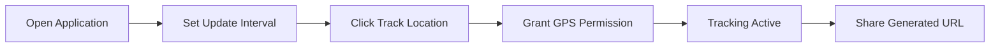
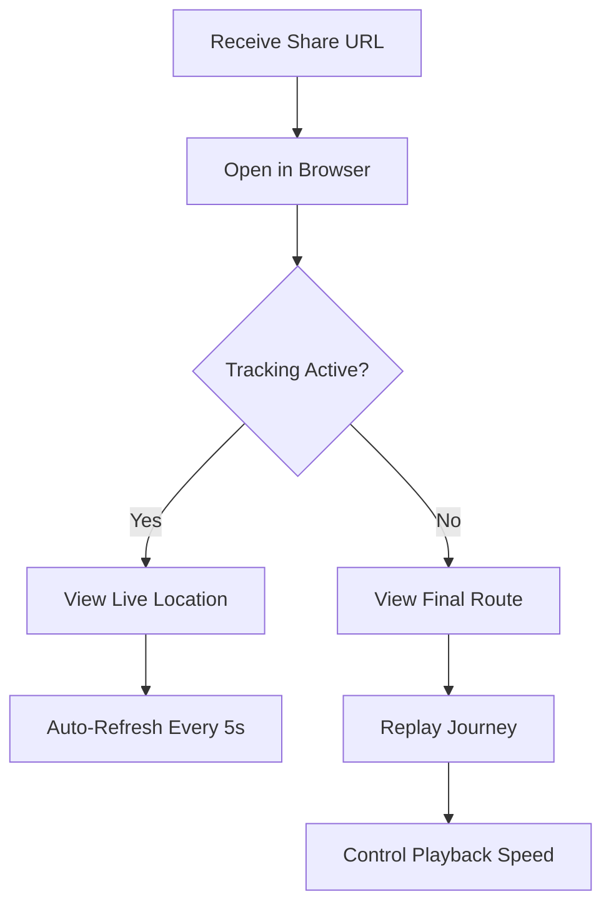
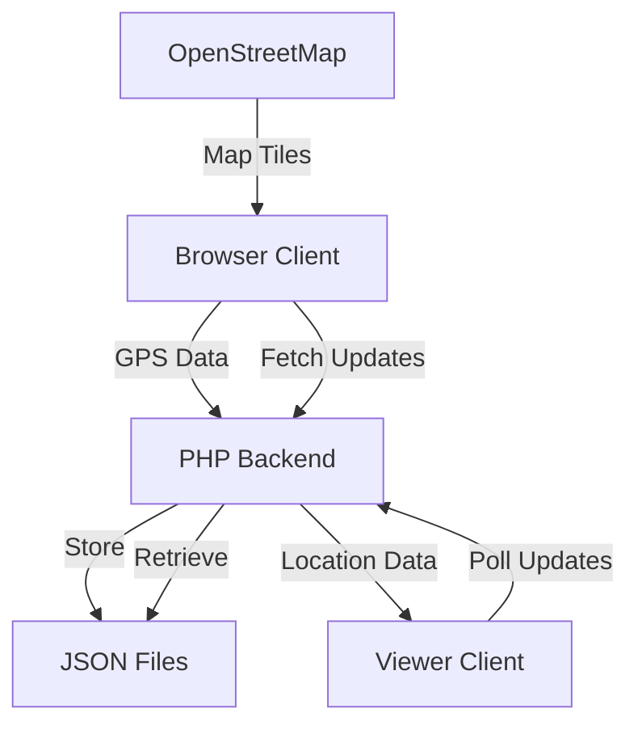

# 📍 xsukax Live Location Tracker

[](https://www.gnu.org/licenses/gpl-3.0)
[](https://php.net)
[](https://github.com/xsukax/xsukax-Live-Location-Tracker)

A lightweight, privacy-focused, self-hosted live location tracking application that enables secure real-time location sharing without requiring user accounts, external dependencies, or third-party services.

## 🔒 Security & Privacy Benefits

### Complete Data Sovereignty
- **Self-Hosted Architecture**: All location data remains on your server with zero reliance on external tracking services
- **No User Accounts Required**: Eliminates password vulnerabilities and personal data collection
- **Anonymous Tracking Sessions**: Each session generates unique anonymous IDs without storing personal information
- **Automatic Data Expiration**: Location data can be configured for automatic cleanup after journey completion
- **No Cookies or Persistent Storage**: Uses only session-based temporary identifiers
- **Encrypted Transit**: Supports HTTPS deployment for end-to-end encryption of location data

### Privacy by Design
- **Minimal Data Collection**: Only stores essential location coordinates and timestamps
- **No Analytics or Telemetry**: Zero tracking scripts, analytics, or third-party monitoring
- **Ephemeral URLs**: Share links are randomized and can be invalidated at any time
- **User-Controlled Tracking**: Complete control over when tracking starts, stops, and who receives access
- **Client-Side Processing**: Map rendering and UI interactions happen locally in the browser

## ✨ Features & Advantages

### Core Functionality
- **🌍 Real-Time Location Updates**: Live GPS tracking with configurable update intervals (1-60 seconds)
- **🔗 Instant Share Links**: Generate unique URLs for selective location sharing
- **📱 Mobile-First Design**: Responsive GitHub-inspired interface optimized for all devices
- **🎬 Journey Replay**: Complete route playback with variable speed controls after tracking ends
- **🗺️ Interactive Maps**: OpenStreetMap integration with route visualization
- **🔋 Battery Optimization**: Adjustable tracking intervals to balance accuracy and power consumption
- **📊 Live Statistics**: Real-time display of coordinates, duration, and last update timestamps
- **⛶ Fullscreen Mode**: Immersive map viewing experience
- **💤 Screen Wake Lock**: Prevents device sleep during active tracking sessions

### Technical Advantages
- **Single-File Deployment**: Entire application in one PHP file for simple installation
- **No Database Required**: Uses lightweight file-based storage
- **Zero npm/Composer Dependencies**: No complex build processes or package management
- **Automatic Heartbeat Monitoring**: Detects disconnected sessions and auto-stops tracking
- **Beacon API Integration**: Ensures tracking stops even on abrupt browser closure
- **Progressive Web App Ready**: Can be saved to home screen on mobile devices

## 📋 System Requirements

- PHP 7.4 or higher
- Web server (Apache/Nginx) with PHP support
- Write permissions for the application directory
- HTTPS recommended for production deployment

## 🚀 Installation Instructions

### Quick Deploy (Single Command)
```bash
# Download and set permissions
wget https://raw.githubusercontent.com/xsukax/xsukax-Live-Location-Tracker/main/index.php
chmod 755 .
```

### Manual Installation

1. **Download the Application**
   ```bash
   git clone https://github.com/xsukax/xsukax-Live-Location-Tracker.git
   cd xsukax-Live-Location-Tracker
   ```

2. **Set Directory Permissions**
   ```bash
   chmod 755 /path/to/application/directory
   ```

3. **Configure Web Server**
   
   **Apache Configuration:**
   ```apache
   <Directory /path/to/application>
       Options -Indexes +FollowSymLinks
       AllowOverride All
       Require all granted
   </Directory>
   ```
   
   **Nginx Configuration:**
   ```nginx
   location /tracker {
       alias /path/to/application;
       index index.php;
       try_files $uri $uri/ /index.php?$query_string;
   }
   ```

4. **Enable HTTPS (Recommended)**
   ```bash
   # Using Let's Encrypt
   certbot --apache -d yourdomain.com
   # or
   certbot --nginx -d yourdomain.com
   ```

## 📱 Usage Guide

### Starting Location Tracking



1. **Initialize Tracking**
   - Navigate to `https://yourdomain.com/index.php`
   - Select update interval (3s for high accuracy, 30s for battery saving)
   - Click "📍 Track My Location"
   - Allow location permissions when prompted

2. **Share Your Location**
   - Copy the generated share URL from the interface
   - Send link to trusted contacts
   - Recipients can view live location without any login

3. **Manage Active Session**
   - Adjust update interval dynamically during tracking
   - Monitor journey statistics in real-time
   - Stop tracking manually or let auto-stop handle disconnections

### Viewing Shared Locations



### Journey Replay System

After tracking ends, both tracker and viewers can:
- Play/pause route animation
- Adjust playback speed (0.5x, 1x, 2x, 5x)
- Seek to specific points via progress bar
- View complete route overlay on map

## 🔧 Configuration Options

### Adjust Heartbeat Timeout
```php
define('HEARTBEAT_TIMEOUT', 30); // Seconds before auto-stop
```

### Configure Data Retention
```php
define('MAX_POINTS', 5000); // Maximum route points stored
```

### Set Default Update Interval
```html
<input type="number" id="initialUpdateInterval" value="5">
```

## 🛡️ Security Best Practices

1. **Deploy Over HTTPS**: Essential for protecting location data in transit
2. **Restrict Directory Listing**: Ensure web server configuration prevents file enumeration
3. **Regular Cleanup**: Implement cron job to remove old tracking files
   ```bash
   # Cleanup files older than 7 days
   0 2 * * * find /path/to/app -name "*.json" -mtime +7 -delete
   ```
4. **Access Control**: Consider implementing IP whitelisting or basic authentication for additional security
5. **Monitor Usage**: Review server logs for suspicious activity patterns

## 🏗️ Architecture Overview



## 🤝 Contributing

Contributions are welcome! Please feel free to submit pull requests, report bugs, or suggest features through the [GitHub Issues](https://github.com/xsukax/xsukax-Live-Location-Tracker/issues) page.

## 📄 License

This project is licensed under the GNU General Public License v3.0.

## 💡 Troubleshooting

### Common Issues

**Location Permission Denied**
- Ensure browser has location access enabled
- Check HTTPS is properly configured
- Verify device GPS is activated

**Write Permission Error**
```bash
# Fix permissions
chmod 755 /path/to/application
chown www-data:www-data /path/to/application
```

**Tracking Auto-Stops**
- Check heartbeat timeout configuration
- Ensure stable internet connection
- Verify browser tab remains active

## 🙏 Acknowledgments

- OpenStreetMap contributors for map data
- Leaflet.js for mapping library
- GitHub Design System for UI inspiration

---

<p align="center">
  Made with ❤️ by <a href="https://github.com/xsukax">xsukax</a>
</p>

<p align="center">
  <a href="https://github.com/xsukax/xsukax-Live-Location-Tracker">View on GitHub</a> •
  <a href="https://github.com/xsukax/xsukax-Live-Location-Tracker/issues">Report Bug</a> •
  <a href="https://github.com/xsukax/xsukax-Live-Location-Tracker/issues">Request Feature</a>
</p>
